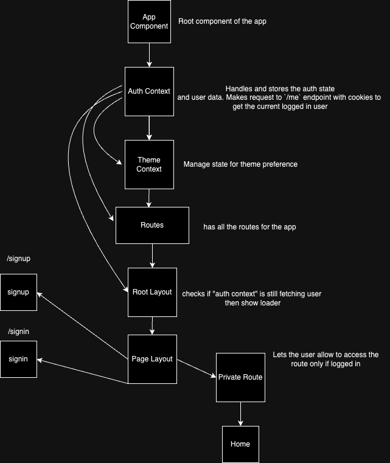
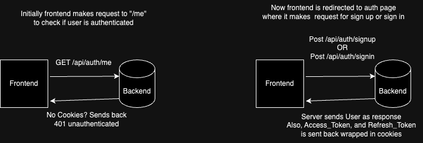

# eg-test

Create and visit your accounts safe and secure! State of the art authentication flow lets you authenticate and access your resources at the speed of light!

<div align="center">
    
</div>

## Technologies

### Frontend

- [React](https://react.dev/): Based on React, the frontend uses features like hooks, contexts, reducers, and reactivity to view and manage DOM.
- [Typescript](https://www.typescriptlang.org/): A strongly typed language that is a superset of Javascript
- [React Router DOM](https://reactrouter.com/en/main): To handle routing in the browser
- [shadcn/ui](https://ui.shadcn.com/): To grab components like buttons and inputs. It adds the snippets directly in the project
- [TailwindCSS](https://tailwindcss.com/): Used for styling and managing CSS in a utility-first approach
- [Axios](https://axios-http.com/docs/intro): An Http client for making http requests in a more organized way, also great error handling.
- [Jest](https://jestjs.io/): Test runner that provide great functions and utilities for testing
- [React Testing Library](https://testing-library.com/docs/react-testing-library/intro/): Used along with Jest, but provides utilities specifically for React. Making testing React apps easy

### Backend

- [NestJS](https://nestjs.com/): Nodejs framework that is highly opinionated about project structure, code management, and expose new paradigms in the Nodejs world.
- [Typescript](https://www.typescriptlang.org/): A strongly typed language that is a superset of Javascript
- [MongoDB](https://www.mongodb.com/): A NoSQL database for storing app data
- [Prisma](https://www.prisma.io/): A simple ORM to interact with database
- [Passport](https://www.passportjs.org/): A middleware to handle authentication flow
- [Nestjs-Pino](https://www.npmjs.com/package/nestjs-pino): A logger for Nestjs that automatically logs the requests and prettify them.
- [bcrypt](https://www.npmjs.com/package/bcrypt): To hash and compare passwords
- [Docker](https://www.docker.com/): To containerize the backend and run in an isolated environment

## Getting Started

Please follow the instructions below to setup eg-test in your local environment

### Prerequisites

Things required to run this project

- Node.js: [Download and Install Node.js](https://nodejs.org/)
- Git: [Download and Install Git](https://git-scm.com/)
- Docker: [Download and Install Git](https://www.docker.com/)
- MongoDB Database: [Create a Database for free](https://www.mongodb.com/cloud/atlas/register)

### Grabbing Code

1. Clone the repository:

   ```bash
   git clone https://github.com/<your-username>/eg-test.git
   ```

### Running the application

#### Backend

1. In the project root, navigate to `server` directory

```bash
  cd server
```

2. Create a `.env` file at the root of the `server` directory

```bash
  touch .env
```

3. Populate `.env` with variables by following `.env.example`

4. Run the backend server in Docker

```bash
  docker-compose up -d --build
```

5. The server has started listening on `http://localhost:3000/api`

6. The documentation of the API endpoints can be found at `http://localhost:3000/docs`

#### Frontend

1. In the project root, navigate to `client` directory

```bash
  cd client
```

2. Create a `.env` file at the root of the `client` directory

```bash
  touch .env
```

3. Populate `.env` with variables by following `.env.example`

4. Install dependencies

```bash
 npm install
```

5. Run the Frontend app. This command will host the FE at `http://localhost:5173`, visit this url

```bash
 npm run dev
```

Visit the url `http://localhost:5173` to view eg-test

- try changing the theme at the top right corner
- visit sign up page, register yourself
- log out of the account by clicking avatar at the top right corner and clicking log out
- try to signin using the same credentials now.
- try to visit the protected home page `/` without authenticating. Should redirect you to auth pages.
- try to visit the sign in page `/signin` while authenticated. Should redirect you to home pages

### Under the hood

#### Component hierarchy for the frontend



- The `Auth Context` is the center for all of the state management for the user auth in the FE app.
- The root of the app is the `App` component that houses the auth and theme contexts as well the `Routes` component.
- The responsibility of the `Auth context` is to make request to `/me` passing cookies along with request to check if the user is authenticated.
- Having the contexts at the top lets all of the components have access to the context's value.
- After that, there is a `Routes` components that has all of the routes of the app listed.
- The `Routes` component uses a couple of layouts including `RootLayout` and `PageLayout`
- The `RootLayout` listens for the loading state of the `/me` request made in the `Auth Context` and based on that shows the loading spinner if the request is still loading.
- Lastly, there is a `Private Component` that is wrapped around the protected routes. In our case, the `Home` route. It checks the `isAuthenticated` state from the `Auth Context` and let only the logged in user access the protected route.

#### Communication between Frontend and Backend



- Initially when the user is not logged in and visits the app. The FE app makes request to `/me` endpoint to check if the user is logged in.
- If the user is not logged in, (there are no cookies available), the server sends back 401 unauthorized. And frontend redirects the user to `/signup` page
- Now the user must sign up or sign in to get authenticated. In this case, frontend makes request to either `/signin` or `/signup`.
- The server sends ACCESS_TOKEN with expiry for `15 minutes` and REFRESH_TOKEN with expiry for `1 day`
- Now if the user visits the app again, the `/me` request will return the user and use can visit protected routes.

## Why did you make certain decisions?

All of the decisions made in the project are made that are appropriate for the task.

For example on the backend, instead of sending access and refresh token in the header, which creates the risk of exposing the tokens and makes it risky for the app. I have used cookies as medium that wraps the jwt tokens and sends cookies to the frontend. Cookies are set http-only, so that Javascript can't access them.

Another decision on the frontend was not to use Redux. I chose to use built-in constructs in React like `Contexts`. The reason was the state was not that complex that it requires a state management solution to be handled. Apart from that it keeps the project lean and small.

### Critical improvements

Configuration:

- Currently the MongoDB instance is run on the cloud and a connection string is provided in .env file to connect. There should be configuration to setup MongoDB locally using Docker compose.

Security

- Add CSRF Tokens to the forms to mitigate Cross-Site-Request-Forgery attack. Currently, the frontend being a single-page application doesn't have mechanism to get the token from the server.

Testing

- Increase test coverage for different modules and edge cases for both FE and BE.
- setup unit tests for backend modules.
- setup automated testing for CI/CD pipelines

Monitoring

- Currently Pino logger is used for logging. Although there should be extensive configuration for different kinds of logs and a log store should be connected to send the logs.

## License

[MIT](https://choosealicense.com/licenses/mit/)
